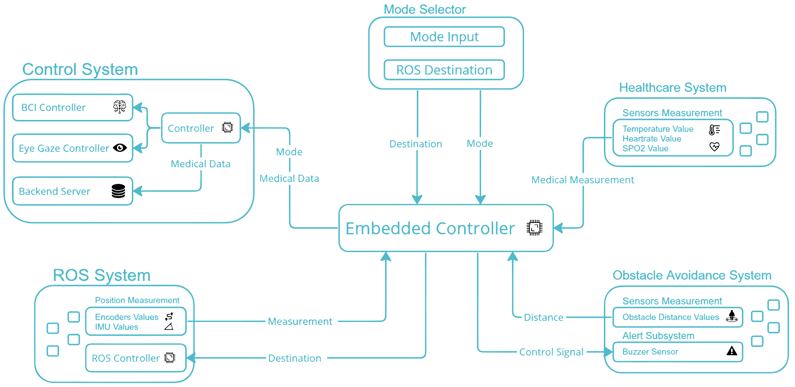
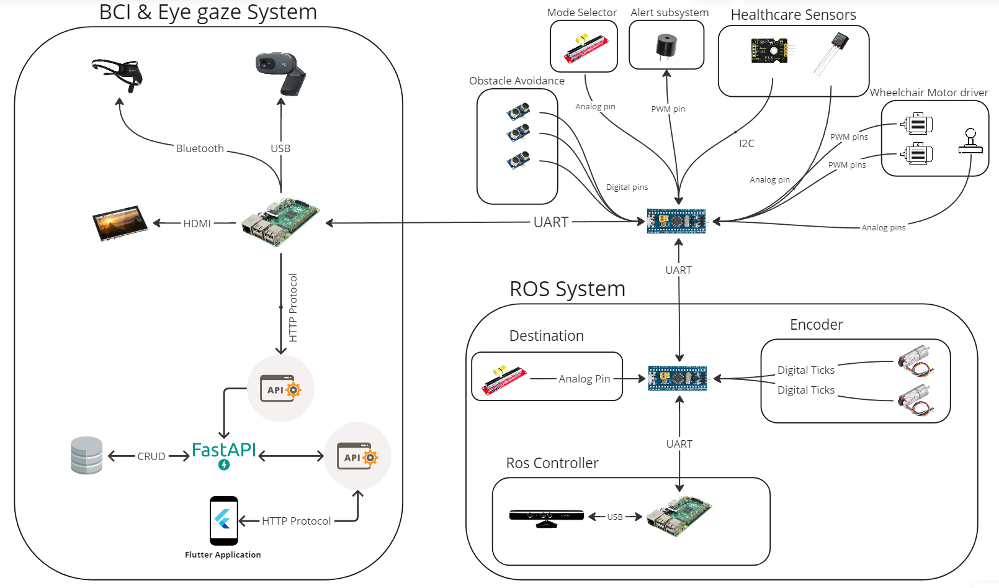
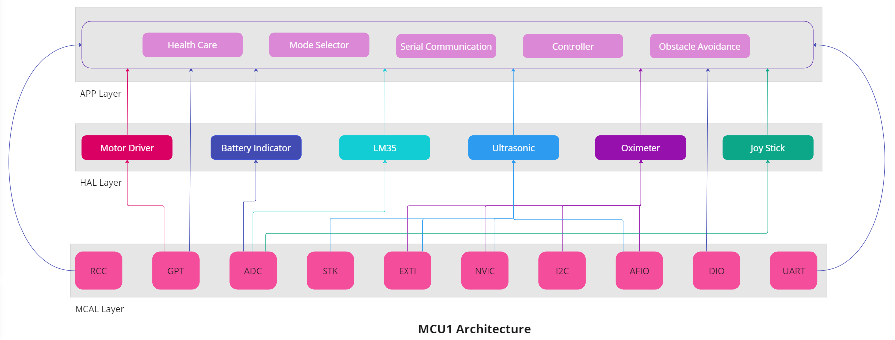
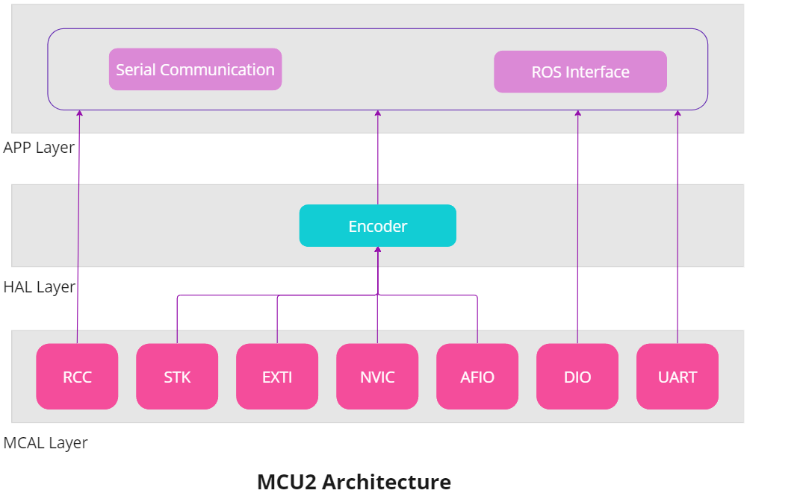
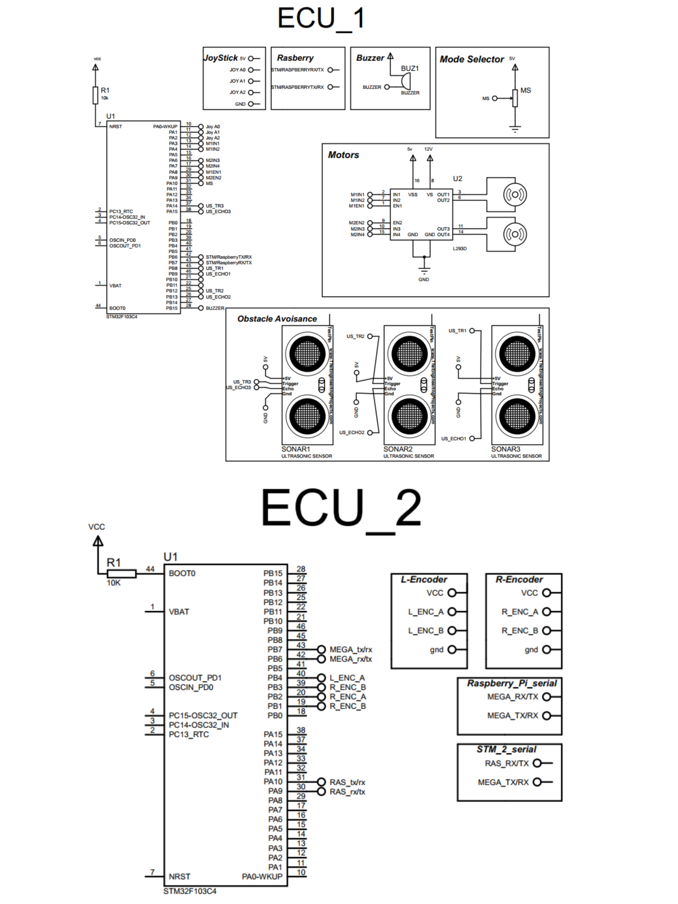
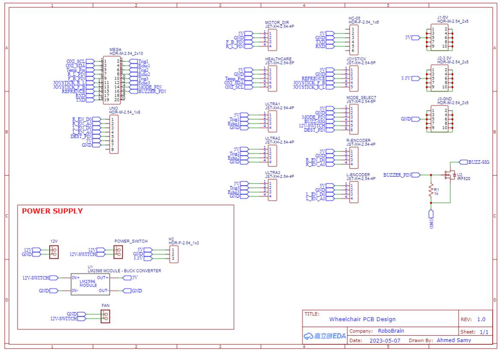
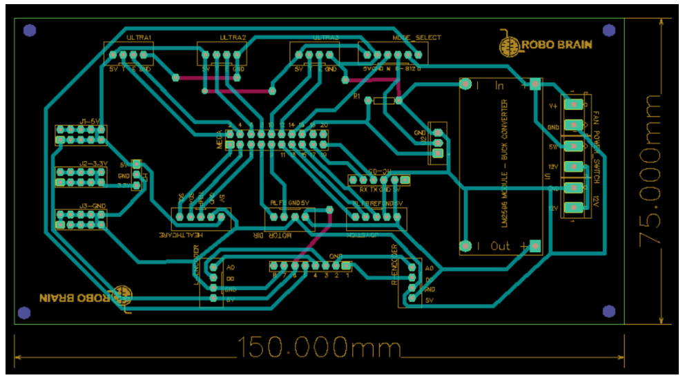

# RoboBrain - A Multimode Wheelchair for Quadriplegia with Healthcare System

Welcome to the **RoboBrain** project repository! This project aims to develop a transformative solution that empowers users with quadriplegia to control a wheelchair using multiple modes, including manual control through a joystick, brain-computer interface (BCI), eye-gaze tracking, and an autonomous mode using ROS. Additionally, the project integrates a comprehensive healthcare system that monitors vital signs and sends them to caregivers' mobile applications, ensuring timely support.

## Features

- Control Modes:
  - Joystick (Manual Mode)
  - Brain-Computer Interface (BCI)
  - Eye-Gaze Tracking
  - ROS Autonomous Mode
  
- Healthcare System:
  - Monitors vital signs: temperature, spo2, heart rate
  - Sends data to caregivers' mobile applications

## System Architecture

The project is organized into several layers:

- **Library Layer**: Contains standard types and common macros.

- **MCAL (Microcontroller Abstraction Layer)**: Provides drivers for various microcontroller peripherals such as RCC, DIO, AFIO, EXTI, ADC, GPT, UART, I2C, STK, and NVIC.

- **HAL (Hardware Abstraction Layer)**: Includes drivers for specific hardware components:
  - Battery Indicator
  - Encoder
  - LM35 Temperature Sensor
  - Oximeter
  - Ultrasonic Sensors

  The HAL layer enables seamless interaction between the microcontroller and the hardware components. It abstracts low-level hardware operations, allowing the application layer to focus on higher-level functionalities without worrying about hardware specifics.

- **App Layer**: Contains various application modules:
  - **Controller**: Manages the overall control logic and coordination of different modes.
  - **Healthcare System**: Reads and transmits vital signs data to caregivers' applications.
  - **Mode Selector**: Enables users to switch between different control modes.
  - **Obstacle Avoidance**: Detects obstacles and ensures safe navigation.
  - **Serial Communication**: Handles communication with external devices.
  - **Main Application Code**: Orchestrates the execution flow of the application.

  The App layer orchestrates the different modes of operation and system functionalities. It bridges the gap between user input and hardware control, ensuring the wheelchair's smooth operation and healthcare features.

## Hardware Components

The project utilizes the following hardware components:

- 2 Encoders for right and left motors
- Joystick
- 3 Ultrasonic Sensors
- 2 Potentiometers
- Oximeter
- LM35 Temperature Sensor
- Buzzer
- 2 STM32F103C8 Microcontrollers

## Workflow

1. The microcontroller reads medical data from the user and the selected mode.
2. It sends the mode and medical data to a Raspberry Pi, which forwards the data to a server.
3. Depending on the mode:
   - For Eye-Gaze or BCI mode, the microcontroller reads data from the Raspberry Pi.
   - For Joystick mode, it reads movement data from the joystick.
4. The system checks for obstacles in the intended movement direction.
5. If an obstacle is detected, the buzzer is activated; otherwise, the wheelchair moves in the desired direction.

## Screenshots

We have included the following screenshots for your reference:

- System Overview

- Stm Diagram

- MCU_1 Architecture

- MCU_2 Architecture

- Schematic Diagram

- PCB Schematic Diagram

- PCB

- Before & After

